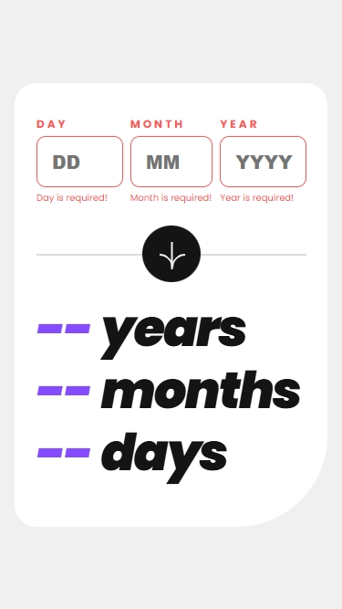
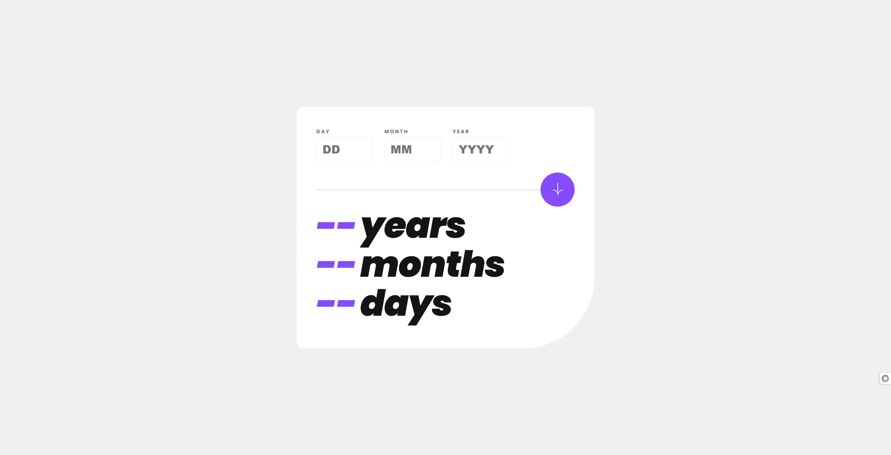
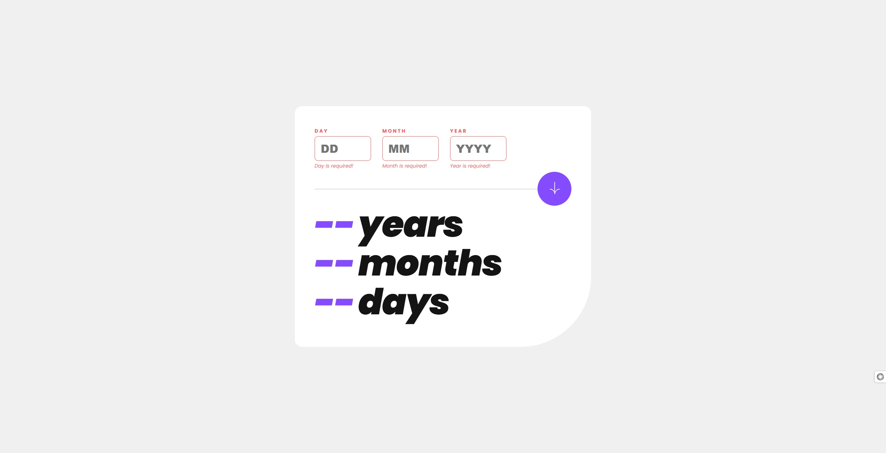
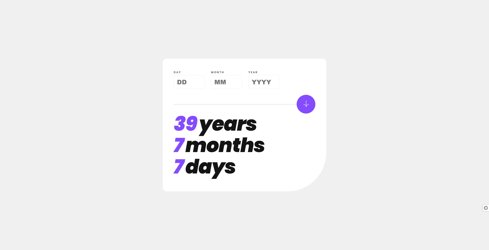

# Age Calculator
The Age Calculator App is a simple yet powerful web application designed to calculate the precise age of a user based on the inputted date of birth. This app takes into account the year, month, and day to provide an accurate age calculation. It is built with a clean and user-friendly interface, making it easy for anyone to use.

## Features
<strong>Date Input:</strong> Users can input their date of birth in a clear and structured format.

<strong>Age Calculation:</strong> The app calculates the user's age in years, months, and days.

<strong>Error Handling:</strong> The app provides error messages for invalid dates or incomplete inputs.

<strong>Responsive Design:</strong> The app is fully responsive and works seamlessly on both mobile (375px screen size) and desktop (1440px screen size) devices.

## Technologies Used
<strong>React:</strong> The app is built using React, a popular JavaScript library for building user interfaces.

<strong>JavaScript (ES6): </strong> The app leverages modern JavaScript features for cleaner and more efficient code.

<strong>CSS:</strong> Custom CSS is used for styling the app, including responsive design adjustments for different screen sizes.

## Installation
To run this project locally, follow these steps:

### 1. Clone the repository:

```bash
git clone https://github.com/your-username/age-calculator-app.git
cd age-calculator-app
```

### 2. Install dependencies:

```bash
npm install
```

### 3. Start the development server:

```bash
npm start
```

4. Open your browser and navigate to http://localhost:3000 to see the app in action.


## Usage
<strong>1. Input Date of Birth:</strong> Enter your birth date in the provided fields (day, month, and year).

<strong>2. Calculate Age:</strong> Click the "Calculate" button to compute your age.

<strong>3. View Results:</strong> Your age in years, months, and days will be displayed on the screen.


## Screenshots
### Mobile View (375px)



### Desktop View (1440px)





